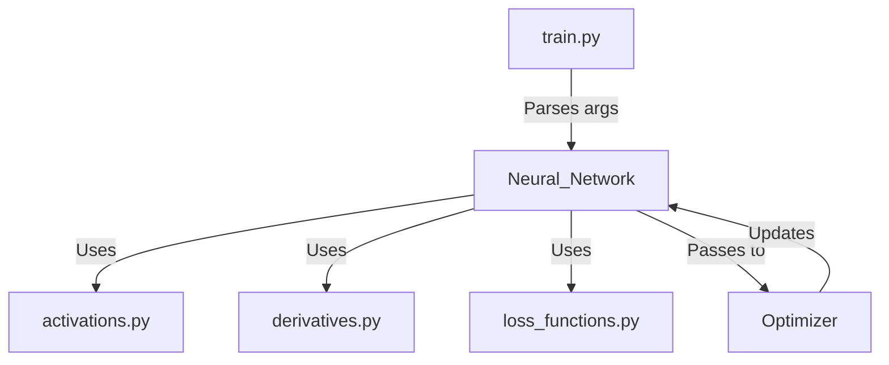

# DA6401 - Deep Learning Assignment 1


[](https://api.wandb.ai/links/cs24m021-iit-madras/9kmya6xn)


A **NumPy-based Feedforward Neural Network** implementation for Fashion-MNIST and MNIST classification, with hyperparameter optimization via **Weights & Biases (WandB)**. Full experimental report available on [WandB Report](https://api.wandb.ai/links/cs24m021-iit-madras/9kmya6xn).

---

## Table of Contents
- [Project Overview](#project-overview)
- [Key Features](#key-features)
- [Code Structure & Implementation](#code-structure--implementation)
- [Repository Structure](#repository-structure)
- [Installation & WandB Setup](#installation--wandb-setup)
- [Training via CLI](#training-via-command-line)
- [Best Configurations](#best-configurations)
- [Self-Declaration](#self-declaration)


---

## Project Overview
This assignment implements a **flexible feedforward neural network from scratch** using NumPy. Key tasks include:
- Backpropagation with **6 optimizers** (SGD, Momentum, NAG, RMSprop, Adam, Nadam).
- Hyperparameter sweeps using WandB.
- Comparative analysis of **cross-entropy vs. MSE loss**.
- MNIST generalization from Fashion-MNIST learnings.

---

## Key Features
- **Modular Codebase**: Separated into `neural_network.py`, `optimizers.py`, and question-specific files.
- **WandB Integration**: Automatic logging of metrics, hyperparameters, and confusion matrices.
- **Flexible Architecture**: Adjustable hidden layers, activation functions, and initialization methods.
- **CLI Support**: Train models with custom hyperparameters via `train.py`.


---

## Code Structure & Implementation

### Core Components
| File | Purpose | Key Classes/Methods |
|------|---------|---------------------|
| `activations.py` | Implements activation functions | `Activation_Functions` class with `sigmoid`, `ReLU`, `tanh`, `softmax` |
| `derivatives.py` | Computes derivatives of activations | `Derivatives` class with methods matching activation names |
| `loss_functions.py` | Handles loss calculations | `Loss_Function.compute_loss()` for CE/MSE, `last_output_derivative()` |
| `neural_network.py` | Main network architecture | `Neural_Network` class with `forward_propagation()`, `backward_propagation()`, `fit()` |
| `optimizers.py` | Implements optimization algorithms | `Optimizer` class with update methods for SGD/Momentum/Adam/etc |
| `train.py` | CLI training entrypoint | Argparse setup, WandB logging, training pipeline |

### Implementation Flow


---


## Repository Structure

```
DA6401_Assignment1/
├── assignment_notebook.ipynb     # Jupyter notebook covering all questions
├── train.py                      # CLI script for model training
├── neural_network.py             # Core neural network class (forward & backward pass)
├── optimizers.py                 # Implementation of optimizers (SGD, Adam, RMSprop, etc.)
├── activations.py                # Activation functions (ReLU, Sigmoid, Tanh, etc.)
├── derivatives.py                # Computation of derivatives for backpropagation
├── loss_functions.py             # Loss function implementations (MSE, Cross-Entropy)
├── requirements.txt              # Dependencies required to run the project
├── wandb_key.txt                 # API key for Weights & Biases (should be kept secret)
├── README.md                     # Documentation for the repository
├── questions/                    # Contains independent scripts for each question
├── wandb/                        # Logs and output files from wandb training runs
├── report_wandb/                 # Folder containing detailed wandb reports
│   ├── charts/                   # Charts and visualizations from training
│   ├── Report.pdf                # Report in PDF Format
│   ├── images/                   # Images and graphs from the assignment
│   ├── README.md                 # Additional README for LaTeX report-related details
│   └── report.tex                # LaTeX report file
└── __pycache__/                   # Compiled Python files (auto-generated)
```

---


## Installation & WandB Setup

1. **Clone the Repository**:
   ```bash
   git clone https://github.com/karan757527/DA6401_Assignment1.git
   cd DA6401_Assignment1
   ```

2. **Install Dependencies**:
   ```bash
   pip install -r requirements.txt
   ```

3. **WandB Configuration**:
   - Create a free account at [wandb.ai](https://wandb.ai/)
   - Add your API key to `wandb_key.txt`
   - Log in via CLI:
     ```bash
     wandb login --relogin
     ```

---


## Training via Command Line

Use `train.py` to train models with custom hyperparameters. Below is the full list of supported arguments:

#### All Arguments
| Argument | Description | Default Value | Choices/Type |
|----------|-------------|---------------|--------------|
| `-wp`, `--wandb_project` | WandB project name | `DA6401_A1` | String |
| `-we`, `--wandb_entity` | WandB entity name | `cs24m021-iit-madras` | String |
| `-d`, `--dataset` | Dataset | `fashion_mnist` | `["mnist", "fashion_mnist"]` |
| `-e`, `--epochs` | Training epochs | `10` | Integer |
| `-b`, `--batch_size` | Batch size | `16` | Integer |
| `-l`, `--loss` | Loss function | `cross_entropy` | `["mean_squared_error", "cross_entropy"]` |
| `-o`, `--optimizer` | Optimizer | `rmsprop` | `["sgd", "momentum", "nag", "rmsprop", "adam", "nadam"]` |
| `-lr`, `--learning_rate` | Learning rate | `0.0001` | Float |
| `-m`, `--momentum` | Momentum (for Momentum/NAG) | `0.9` | Float |
| `-beta`, `--beta` | Beta (RMSprop) | `0.9` | Float |
| `-beta1`, `--beta1` | Beta1 (Adam/Nadam) | `0.9` | Float |
| `-beta2`, `--beta2` | Beta2 (Adam/Nadam) | `0.999` | Float |
| `-eps`, `--epsilon` | Numerical stability term | `0.000001` | Float |
| `-w_d`, `--weight_decay` | Weight decay (L2) | `0.0005` | Float |
| `-w_i`, `--weight_init` | Weight initialization | `Xavier` | `["random", "Xavier"]` |
| `-nhl`, `--num_layers` | Number of hidden layers | `4` | Integer |
| `-sz`, `--hidden_size` | Neurons per hidden layer | `128` | Integer |
| `-a`, `--activation` | Activation function | `ReLU` | `["identity", "sigmoid", "tanh", "ReLU"]` |


---

#### Example Command (Best Configuration from Report)
```bash
python train.py \
  --wandb_project DA6401_A1 \
  --wandb_entity your_entity \
  --dataset fashion_mnist \
  --epochs 10 \
  --batch_size 16 \
  --optimizer rmsprop \
  --learning_rate 0.0001 \
  --weight_init Xavier \
  --num_layers 4 \
  --hidden_size 128 \
  --activation ReLU \
  --weight_decay 0.0005 \
  --beta 0.9 \
  --beta1 0.9 \
  --beta2 0.999
```

####  Shortened Version with Defaults
```bash
python train.py -wp DA6401_A1 -we your_entity -d fashion_mnist -o rmsprop -lr 0.0001 -w_i Xavier -nhl 4 -sz 128 -a ReLU
```

> For MNIST experiments, add `-d mnist`. See [report](https://api.wandb.ai/links/cs24m021-iit-madras/9kmya6xn) for optimal configurations.

---


## Best Configurations
| Dataset         | Optimizer | Hidden Layers | Accuracy |
|-----------------|-----------|---------------|----------|
| **Fashion-MNIST** | RMSprop   | 4x128 (ReLU)  | 87.96%   |
| **MNIST**         | Adam      | 3x128 (ReLU)  | 97.52%   |


---

## Self-Declaration
*I, Karan Agrawal, affirm that this work is my own and complies with academic integrity standards.*

---
